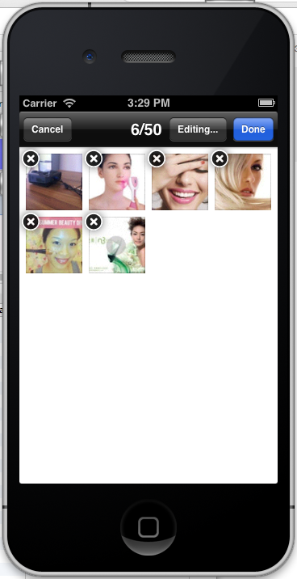

# ReadMe

## open source code list
* GMGridView (with a little adjustment)
* SDWebImage (for cache)
* MBProgressHUD
* ELCImagePicker (with a little adjustment)

## previewimage

## how to use
### imported framework
* QuartzCore.framework
* ImageIO.framework
* AssetsLibrary.framework

### code
	/*
	 * load view
	 */
    TYPhotoWallController *tyPhotoWallController = [[TYPhotoWallController alloc] initWithNibName:@"TYPhotoWallController" bundle:nil];
    tyPhotoWallController.delegate = self;
    tyPhotoWallController.maxPictureNumber = 50;
    UINavigationController *navController = [[UINavigationController alloc] initWithRootViewController:tyPhotoWallController];
    [self.navigationController presentViewController:navController animated:NO completion:^{}];
    [tyPhotoWallController importPicturesAnimated:NO];

    /*
     * delegate method
     */
     #pragma mark - TYPhotoWallControllerDelegate
	- (void)tyPhotoWallControllerDidCancelPicking:(TYPhotoWallController *)mpPhotoWall
	{
    	[self.navigationController dismissViewControllerAnimated:YES completion:^{}];
	}

	- (void)tyPhotoWallControllerDidFinishPicking:(TYPhotoWallController *)tyPhotoWall clearImages:(ELCImages *)clearImages thumbnails:(ELCImages *)thumbnails
	{
    	[self.navigationController dismissViewControllerAnimated:YES completion:^{}];
    	CGRect workingFrame = self.scrollView.frame;
		workingFrame.origin.x = 0;
	
    	for (UIView *v in self.scrollView.subviews) {
        	if (![v isKindOfClass:[UIImageView class]]) {
           		[v removeFromSuperview];
       		 }
   		}
    
    	NSLog(@"Clear Image count:%d",clearImages.count);
    	for (NSUInteger index = 0; index < clearImages.count; index++) {
        	UIImageView *imageView = [[UIImageView alloc] initWithImage:[clearImages imageAtIndex:index]];
        	[imageView setContentMode:UIViewContentModeScaleAspectFit];
        	imageView.frame = workingFrame;
        	[self.scrollView addSubview:imageView];
        
        	workingFrame.origin.x = workingFrame.origin.x + workingFrame.size.width;
    	}
    
		[self.scrollView setPagingEnabled:YES];
		[self.scrollView setContentSize:CGSizeMake(workingFrame.origin.x, workingFrame.size.height)];
	}

## license
follow the most strict license in the four open source project listed above